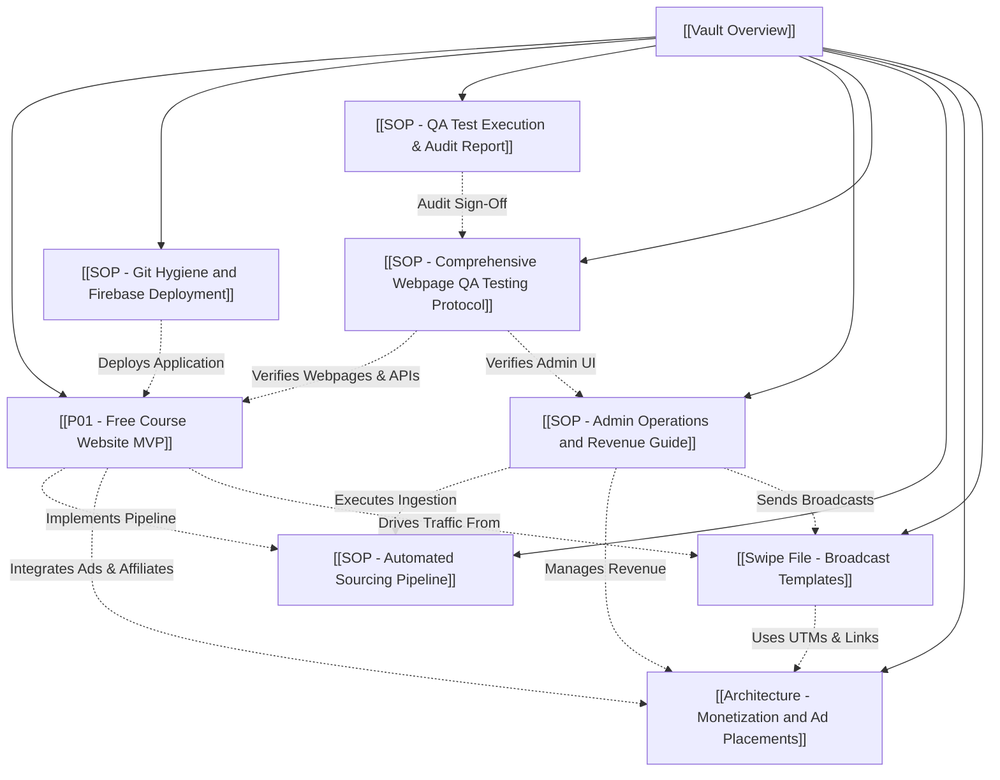

# 🧠 Obsidian Second Brain - Free Course Platform Knowledge Vault

#meta #dashboard #overview

Welcome to the **Free Course Platform Second Brain**, structured following the **PARA Method** (Projects, Areas, Resources, Archives).

---

## 🗂️ Vault Structure & Master Index

### 📁 `01 Projects/` (Short-term efforts with a specific goal and deadline)
- [[P01 - Free Course Website MVP]] — Sprint backlog, component hierarchy, legal compliance tasks, scraper pipeline integration, and deployment checklists.

### 📁 `02 Areas/` (Long-term responsibilities to maintain over time)
- [[SOP - Git Hygiene and Firebase Deployment]] — Git index cleaning guide, `.gitignore` rules, `firebase.json` config, and GitHub Actions deploy workflow.
- [[SOP - QA Test Execution & Audit Report]] — Final QA audit report with 100% test execution pass log, route compilation audit, and sign-off.
- [[SOP - Admin Operations and Revenue Guide]] — Master A-Z guide explaining admin setup, Rakuten/AdSense approval steps, daily broadcast operations, and revenue generation.
- [[SOP - Comprehensive Webpage QA Testing Protocol]] — Complete QA testing protocol covering every webpage, component, test criteria, and API endpoint.
- [[SOP - Automated Sourcing Pipeline]] — Data feed sources, 6-12h cron frequencies, auto-expiration rules (>48h or ≥3 user reports), and manual override SOP.

### 📁 `03 Resources/` (Topics and interest areas for reference)
- [[Architecture - Monetization and Ad Placements]] — Google AdSense container specifications, Rakuten Udemy deep-link URL generator specs, and secondary affiliate widgets.
- [[Swipe File - Broadcast Templates]] — Copywriting templates for Telegram and WhatsApp daily drops, category roundups, and UTM parameter matrix.

---

## 🔗 Related Notes Map

---

## 🛠️ Tech Stack & Automation Quick Reference
- **Frontend:** Next.js (App Router), TypeScript, Tailwind CSS, Fuse.js
- **Admin Control:** Dedicated Admin Dashboard (`/admin`)
- **Deployment:** Firebase Hosting + GitHub Actions (`.github/workflows/firebase-deploy.yml`)
- **Scraper:** Node.js / TypeScript (`scripts/scrape-coupons.ts`)
- **CI/CD Automation:** GitHub Actions (`.github/workflows/sync-coupons.yml`)
- **Monetization:** Google AdSense + Rakuten Advertising (Udemy MID: `13884`)
