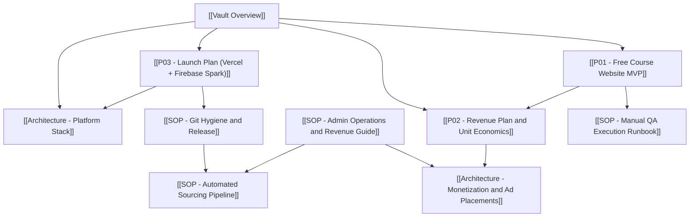

# 🧠 Obsidian Second Brain - Free Course Platform

#meta #dashboard #overview #para

Knowledge vault for the **Free Course Platform** (PARA method).  
**Infrastructure:** Vercel (host) + Firebase Spark (Firestore). Start here → [[P03 - Launch Plan (Vercel + Firebase Spark)]].

---

## 🗂️ Vault structure

### `00 Meta/`
| Note | Purpose |
| :--- | :--- |
| [[Vault Overview]] | This page — master index |

### `01 Projects/` — time-bound outcomes
| Note | Purpose |
| :--- | :--- |
| [[P01 - Free Course Website MVP]] | Product built; feature backlog & DoD |
| [[P02 - Revenue Plan and Unit Economics]] | Monetization after launch |
| [[P03 - Launch Plan (Vercel + Firebase Spark)]] | **Step-by-step go-live ($0 stack)** |

### `02 Areas/` — ongoing responsibilities

**DevOps/**
| Note | Purpose |
| :--- | :--- |
| [[SOP - Git Hygiene and Release]] | Git, Vercel deploy, Firestore rules, GitHub Actions |
| [[SOP - Automated Sourcing Pipeline]] | Coupon ingest → Firestore, 6h cron |

**Operations/**
| Note | Purpose |
| :--- | :--- |
| [[SOP - Admin Operations and Revenue Guide]] | `/admin`, broadcasts, revenue ops |

**QA/**
| Note | Purpose |
| :--- | :--- |
| [[SOP - Manual QA Execution Runbook]] | Live manual test sessions |
| [[SOP - Comprehensive Webpage QA Testing Protocol]] | Master test case catalog |
| [[SOP - QA Test Execution & Audit Report]] | Historical audit (superseded by runbook) |

### `03 Resources/` — reference
| Note | Purpose |
| :--- | :--- |
| [[Architecture - Platform Stack]] | Vercel + Firebase Spark blueprint |
| [[Architecture - Monetization and Ad Placements]] | Ads, Rakuten, affiliate slots |
| [[Swipe File - Broadcast Templates]] | Telegram / WhatsApp copy + UTMs |

---

## 🔗 System map

---

## 🛠️ Tech stack (quick reference)

| Layer | Technology |
| :--- | :--- |
| App | Next.js 15, TypeScript, Tailwind, Fuse.js |
| Hosting | **Vercel** (Hobby / free) |
| Database | **Firebase Spark** — Firestore `courses` |
| Admin | `/admin` + `firebase-admin` |
| CI | GitHub Actions: `firestore-rules.yml`, `sync-coupons.yml` |
| Firebase project ID | `free-course-platform` |
| Monetization | Rakuten + AdSense (see P02) |

**Not in use:** Firebase Hosting (requires Blaze for this Next.js app).
