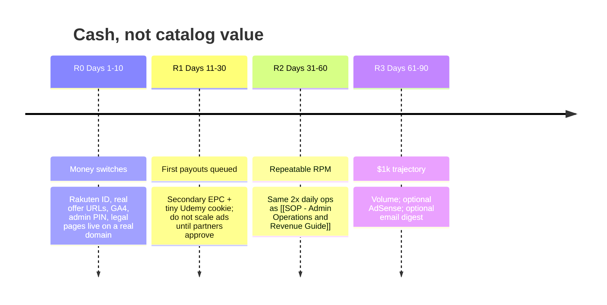

# P02 - Revenue Plan & Unit Economics

#project #revenue #unit-economics #adsense #rakuten #affiliates

> **Document Type:** Business plan for turning the shipped MVP into cash  
> **Status:** 🟡 Ready to execute — site + Firestore catalog; money switches still off  
> **Parent Project:** [[P01 - Free Course Website MVP]]  
> **Ops Execution:** [[SOP - Admin Operations and Revenue Guide]]  
> **Placement Specs:** [[Architecture - Monetization and Ad Placements]]  
> **Traffic Copy:** [[Swipe File - Broadcast Templates]]  
> **Launch prerequisite:** [[P03 - Launch Plan (Vercel + Firebase Spark)]]  
> **Master Index:** [[Vault Overview]]

---

## 1. Current State (honest)

The website, admin console, scraper, ad *slots*, and Rakuten URL wrapper are built. Revenue is **not** live because the money layer is still placeholders:

| Switch | In the product today | Required to earn |
| :--- | :--- | :--- |
| Udemy / Rakuten | `generateUdemyAffiliateUrl()` uses `NEXT_PUBLIC_RAKUTEN_PUB_ID` or a demo token | Approved publisher ID in env |
| Google AdSense | `AdBanner.tsx` renders mock “AdSense” / sponsored cards, not `adsbygoogle` | Live `ca-pub-…` + approved site |
| Secondary offers | Env `NEXT_PUBLIC_AFFILIATE_VPN_URL` / `VPS` / `TOOLS` (href `#` if unset) | Real partner landing URLs |
| Attribution | UTM matrix exists in the swipe file | GA4 (or Plausible) + Rakuten SubIDs (`u1`) wired per channel |
| Payouts | Timeline sketch only | Bank / Payoneer on Rakuten + AdSense; tax identity |

**Implication:** traffic sent today would generate **impressions and clicks with $0 attributable revenue**.

---

## 2. How this niche actually makes money

Udemy **100% OFF** checkouts are `$0.00` to the learner. Rakuten typically pays a **% of the paid sale**, not of a free enrollment. Treat free-coupon clicks as a **cookie + upsell funnel**, not as a CPA on the free course.

```
Telegram / WhatsApp drop
        │
        ▼
Site visit  ──►  Display ads (if AdSense approved)
        │
        ├─► [Get Free Course] ──► Rakuten ──► Udemy $0 enroll
        │                              │
        │                              └── 7–30 day cookie: later paid Udemy buy = commission
        │
        └─► Secondary CTA (VPN / VPS / Coursera) ──► higher EPC, first real dollars
```

**Target mix after month 3 (same as architecture, restated as cash, not UI):**

| Stream | Share of revenue | Role | Reliability |
| :--- | :--- | :--- | :--- |
| Secondary affiliates (VPN, VPS, tools) | 45–55% early, 25–35% later | First dollars; category-matched CTAs | High if offers are real |
| Udemy / Rakuten (cookie + paid catalog) | 30–45% | Core brand; delayed, lumpy | Medium — depends on cookie conversion |
| Display (AdSense) | 15–25% if approved | RPM on broadcast landings | Low until approval; policy risk on coupon sites |

Do **not** wait on AdSense to start earning. Sequence: **Rakuten + secondary offers first**, AdSense second.

---

## 3. Assumptions (lock these; update after 14 days of real data)

Use conservative numbers until GA4 and Rakuten reports exist.

| Metric | Conservative | Base | Aggressive | Notes |
| :--- | ---: | ---: | ---: | :--- |
| Unique site visits / day (after channels exist) | 200 | 800 | 2,500 | Broadcast-driven, not SEO at first |
| Pages / session | 1.4 | 1.8 | 2.2 | Directory + modal |
| CTR on “Get Free Course” | 18% | 28% | 38% | High-intent coupon traffic |
| Free enrollments that later buy paid Udemy (cookie) | 0.4% | 1.0% | 2.0% | The real Udemy lever |
| Avg paid Udemy order (after coupon / sale) | $12 | $18 | $28 | Promo pricing, not $84 list |
| Rakuten commission rate | 8% | 12% | 15% | Confirm in publisher T&Cs |
| Secondary offer CTR (in-feed / header) | 0.4% | 0.9% | 1.5% | Native-looking cards |
| Secondary EPC (earnings per click) | $0.40 | $1.20 | $3.00 | VPN/VPS mix |
| AdSense RPM (if approved, page RPM) | $1.50 | $4.00 | $8.00 | Many coupon sites never get this |

### Unit economics (base case, per 1,000 visits)

1. **Udemy:** 1,000 × 28% click × 1.0% cookie conversion × $18 × 12% ≈ **$0.60**
2. **Secondary:** 1,000 × 0.9% click × $1.20 EPC ≈ **$10.80**
3. **AdSense:** 1,000 × $4.00 / 1000 ≈ **$4.00** (zero until approved)

**Base RPM ≈ $11.40 / 1,000 visits with ads; ≈ $11.40 wait — $10.80 + $0.60 = $11.40 without ads, $15.40 with ads.**

That is why **secondary widgets are the revenue plan**, not an afterthought. Udemy branding drives traffic; VPN/VPS/tool cards pay the bills until cookie volume is large.

---

## 4. Path to first $1,000 (revised, with math)

Replace the vague Day-1–30 sketch. Cash is a function of **visits × RPM**, not of “having a dashboard.”

**Target:** $1,000 net publisher payouts (not Gross Merchandise Value of free courses).

| Phase | Calendar | Traffic goal | RPM used | Expected cash | What you actually do |
| :--- | :--- | :--- | :--- | :--- | :--- |
| **R0 — Switch on** | Days 1–10 | 0 paid traffic | $0 | $0 | Domain, Rakuten apply, secondary offer URLs, env vars, GA4 |
| **R1 — First dollars** | Days 11–30 | 150–400 visits/day | ~$10 (no AdSense) | $50–$120 | 2× daily drops, 1 niche channel, live secondary CTAs |
| **R2 — Repeatable** | Days 31–60 | 600–1,000 visits/day | ~$11–15 | $200–$450 | 2nd WhatsApp list, category specials, prune dead coupons |
| **R3 — $1k run-rate** | Days 61–90 | 1,200–2,000 visits/day | ~$12–16 | $450–$960 in the month | SEO pages optional; AdSense only if approved |

**Break-even visit math (base, no AdSense):**  
$1,000 / $11.40 per 1,000 visits ≈ **88,000 visits**.  
At 800 visits/day that is **~110 days**. At 2,000 visits/day it is **~44 days**.

First $1,000 is a **traffic problem** once R0 is done, not a missing React component.



---

## 5. Partner & payout mechanics

### 5.1 Rakuten / Udemy (MID `13884`)

1. Apply as publisher with the **live domain** (not localhost). Site must show original UX, FTC disclosure, and working outbound links.
2. After approval, set:
   ```env
   NEXT_PUBLIC_RAKUTEN_PUB_ID=<publisher_sid_or_token>
   ```
3. Map `u1` / SubID to channels: `telegram`, `whatsapp`, `website`, `seo`. Admin “Draft” posts already assume UTMs; keep SubID in the Rakuten URL as well so **Rakuten reports** match **GA4**.
4. Payout: network threshold + cookie reporting lag (**15–45 days** typical). Do not treat “enrollments” in `/admin` as revenue.
5. **Policy:** do not cloak, do not promise Udemy endorsement, do not harvest coupons in a way that violates Udemy instructor/affiliate rules. Expired-link hygiene ([[SOP - Automated Sourcing Pipeline]]) protects approval.

### 5.2 Secondary networks (priority order)

Apply in this order because EPC and approval speed beat AdSense:

1. **VPN** (NordVPN / Surfshark / similar via Impact or in-house) — cybersecurity & “lab” course context.
2. **Cloud VPS** (DigitalOcean, Vultr, Hetzner) — web/dev/DevOps cards.
3. **Learning upsell** (Coursera Plus, DataCamp) — users who want a structured path after a free Udemy taste.
4. Optional: JetBrains, GitHub student/Copilot only if the program allows coupon-site traffic.

Each offer needs: unique tracking URL, geo fallback (or hide by category), and a disclosure line. Set `NEXT_PUBLIC_AFFILIATE_VPN_URL`, `NEXT_PUBLIC_AFFILIATE_VPS_URL`, and `NEXT_PUBLIC_AFFILIATE_TOOLS_URL`. Unset URLs render as `#`.

### 5.3 Google AdSense

Treat as **optional upside**, not the plan:

- Submit only after custom domain, privacy/terms/affiliate pages, and real content (not empty catalog).
- Coupon aggregators are frequently **denied** (thin/scraped/redirecty). If denied, keep native affiliate cards; do not stuff more ads.
- If approved, swap mock `AdBanner` slots for real `adsbygoogle` units per [[Architecture - Monetization and Ad Placements]]. Keep reserved `min-height` for CLS.
- Threshold ~$100; invalid-click risk on Telegram/WhatsApp is real — never incentivize ad clicks in broadcasts.

---

## 6. Tracking that makes the plan measurable

Without this, you cannot tell if RPM is $3 or $15.

| Layer | Tool | What to record |
| :--- | :--- | :--- |
| Site | GA4 or Plausible | sessions, source (`utm_source`), outbound clicks |
| Udemy | Rakuten reports | clicks, sales, SubID (`u1`) |
| Secondary | Partner dashboards | clicks, conversions, EPC by placement (`header` / `infeed` / `modal` / `footer`) |
| Ops | `/admin` | active deals, reports, expired — quality, not revenue |

**Weekly KPI set (owner reviews every Monday):**

1. Visits, CTR to Udemy, CTR to secondary.
2. Rakuten reported sales (even if $0).
3. Secondary EPC and top placement.
4. % of catalog expired / ≥3 reports (trust → conversion).
5. Channel mix: Telegram vs WhatsApp vs direct.

Kill a placement if it has CTR with **zero** 14-day conversions; rewrite copy before adding more slots.

---

## 7. Channel plan (ties revenue to the swipe file)

Broadcasts must land on **the website**, not raw Udemy URLs. Otherwise AdSense (if any) and secondary CTAs earn $0.

| Channel | Cadence | Job | Revenue job |
| :--- | :--- | :--- | :--- |
| Telegram daily drop | 12:00 & 18:00 | Volume | Sessions + Udemy clicks |
| Telegram niche special | 3× / week | Higher intent | Better cookie + VPN/VPS match |
| WhatsApp compact | 1–2× / day | Mobile sessions | Footer sticky + in-feed |
| Weekend pack | Sat | Category pages | More pages / session |

Copy and UTMs: [[Swipe File - Broadcast Templates]]. Do not add “click the ad” language.

---

## 8. Risks that zero out the model

| Risk | Effect | Mitigation |
| :--- | :--- | :--- |
| Rakuten / Udemy reject or drop the site | Core deep links die | Keep secondary network diversity; original roundup writeups, not only scraped titles |
| AdSense never approves | Lose 15–25% upside | Plan already works on affiliates alone |
| $0 commissions forever on free checkouts | Udemy stream stays tiny | Push secondary EPC; add a few **paid** deal posts only if compliant |
| Invalid traffic / click fraud | Account bans | Organic groups, no paid click-exchange, no VPN farms |
| Dead coupons | Trust collapse, CTR crash | 6h sync + 48h / 3-report expire rules |
| Compliance (FTC, trademarks) | Takedowns | Live `/affiliate-disclosure`, `/privacy-policy`, `/terms-of-service` |

---

## 9. Go-live checklist (this *is* completing the revenue plan in the product)

- [ ] Custom domain live; legal pages crawlable
- [ ] `ADMIN_SECRET_KEY` changed from `admin123`
- [ ] Rakuten application submitted + `NEXT_PUBLIC_RAKUTEN_PUB_ID` set after approval
- [ ] Real VPN + VPS (and optional Coursera) URLs in env; `AdBanner` / modal no longer use bare `click.linksynergy.com`
- [ ] GA4 (or Plausible) + UTM + Rakuten `u1` aligned with the swipe-file matrix
- [ ] AdSense submitted **or** explicitly deferred; mock labels not left as “AdSense” if not approved
- [ ] First Telegram + WhatsApp properties created; 14-day baseline before spending on ads
- [ ] Calendar reminder: Rakuten/AdSense payout methods + tax forms

When the boxes above are checked, P02 moves from **plan** to **operations** and is run daily via [[SOP - Admin Operations and Revenue Guide]].

---

## 10. Definition of done for P02

1. A publisher can explain **where the first $100 comes from** (secondary EPC, not AdSense, not $0 Udemy checkouts).
2. Env-backed tracking IDs exist; dummy affiliate hrefs are gone.
3. A 14-day KPI sheet exists with visits, CTRs, and partner-reported earnings.
4. Path to $1,000 is expressed as **visits × RPM**, with a named traffic cadence, not a slogan.
