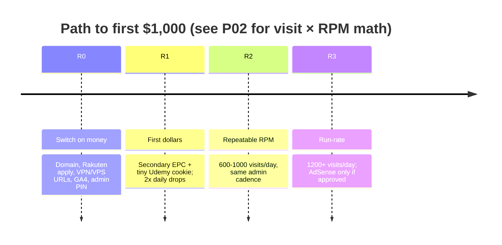

# SOP: Admin Operations & A-Z Revenue Guide

#sop #admin #revenue #monetization #operations #guide #dashboard

> **Document Type:** Master Operational & Revenue SOP  
> **Area:** Platform Administration & Business Operations  
> **Target Audience:** Admin / Platform Owner  
> **Web Admin Route:** [[P01 - Free Course Website MVP|Web Dashboard (/admin)]]  
> **Parent Project:** [[P01 - Free Course Website MVP]]  
> **Monetization Architecture:** [[Architecture - Monetization and Ad Placements]]  
> **Pipeline SOP:** [[SOP - Automated Sourcing Pipeline]]  
> **Broadcast Templates:** [[Swipe File - Broadcast Templates]]  
> **Master Index:** [[Vault Overview]]

---

## 1. Executive Summary & Revenue Model

This platform operates a dual-stream revenue engine powered by high-intent broadcast traffic:

```
Broadcast Channels (Telegram / WhatsApp)
               │
               ▼
   Web Directory Landing Page (AdSense Impressions Served)
               │
               ├─────────────────────────────────┐
               ▼                                 ▼
   [Copy Coupon Code] / [Get Free Course]    Secondary Referral Widgets
               │                             (VPN / Hosting / SaaS)
               ▼                                 │
   Rakuten Deep-Link Redirect                    ▼
               │                           Affiliate Payout
               ▼
   Udemy Checkout ($0.00 to User) ──► 15-45 Day Cookie Commission Payout
```

1. **Display Advertising (Google AdSense):** Every visitor arriving from social broadcasts generates high-viewability ad impressions across header, in-feed, and sticky mobile ad containers.
2. **Affiliate Deep-Linking (Rakuten / Udemy):** Users click "Get Free Course", routing through Rakuten deep-links. When users enroll in free deals or subsequently buy paid courses within the 7-day to 30-day cookie window, affiliate commissions are credited.
3. **Secondary Referral Widgets:** Contextual offers for developer tools (e.g. \$100 VPS credits, 70% OFF VPNs) placed directly on course cards and detail modals.

---

## 2. Using the Dedicated Web Admin Dashboard (`/admin`)

The platform includes a browser-based Admin Console at **`/admin`** for complete hands-free management:

### Accessing the Dashboard
1. Open `https://YOUR-VERCEL-URL/admin` (or `http://localhost:3000/admin` locally).
2. Enter your **Admin Secret Key** (Default key: `admin123` or value set in `.env.local` `ADMIN_SECRET_KEY`).

### Dashboard Features & Capabilities

1. **📊 Real-Time Metric Tickers:**
   - Active Deals Count, Community Flagged Reports, Auto-Suppressed Expired Deals, and Total Catalog Dollar Value.
2. **🛠️ Course Moderation Table:**
   - **Reset Flags:** Clears community reports if a user wrongly flagged a working deal.
   - **Force Expire:** Instantly hides dead deals from the website.
   - **Re-activate:** Restores an expired deal and extends expiry date.
   - **Draft Broadcast Post:** Generates 1-click formatted Telegram/WhatsApp text with UTM tracking parameters ready to drop into social channels.
3. **➕ Add New Course Web Form:**
   - Enter course details (Title, Udemy Link, Coupon Code, Price).
   - Automatically wraps target URL with Rakuten affiliate deep-linking (`MID: 13884`).
4. **⚡️ Live Scraper Sync Button:**
   - 1-Click button to manually trigger the coupon ingestion pipeline.

---

## 3. Pre-Launch Configuration Checklist

Before launching traffic broadcasts, complete this checklist:

### Step 1: Infrastructure (Vercel + Firebase Spark)

Complete [[P03 - Launch Plan (Vercel + Firebase Spark)]] first. Minimum env vars:

```env
FIREBASE_PROJECT_ID=free-course-platform
FIREBASE_SERVICE_ACCOUNT={"type":"service_account",...}
ADMIN_SECRET_KEY=your_secure_admin_password_here
CRON_SECRET=your_cron_secret_here
NEXT_PUBLIC_SITE_URL=https://your-app.vercel.app
```

Set the same keys in **Vercel** → Project → Environment Variables (Production).

### Step 2: Rakuten Advertising Affiliate Registration
1. Register at [Rakuten Advertising](https://rakutenadvertising.com/).
2. Apply to **Udemy** (Merchant ID `13884`).
3. Add to Vercel + `.env.local`:
   ```env
   NEXT_PUBLIC_RAKUTEN_PUB_ID=your_publisher_id
   NEXT_PUBLIC_AFFILIATE_VPN_URL=https://...
   NEXT_PUBLIC_AFFILIATE_VPS_URL=https://...
   NEXT_PUBLIC_AFFILIATE_TOOLS_URL=https://...
   ```

### Step 3: Google AdSense (optional)
1. Use your **Vercel production URL** or custom domain.
2. Legal pages must be live: `/privacy-policy`, `/terms-of-service`, `/affiliate-disclosure`.
3. Apply in [AdSense Console](https://adsense.google.com/).
4. If approved, add publisher ID to `AdBanner.tsx`.

### Step 4: Automated coupon sync (GitHub Actions)
1. GitHub secret `FIREBASE_SERVICE_ACCOUNT_FREE_COURSE` = service account JSON.
2. Firestore enabled on project `free-course-platform` (Spark plan OK).
3. Workflow `sync-coupons.yml` runs every 6 hours.
4. Rules deploy via `firestore-rules.yml` when `firestore.rules` changes.

---

## 4. Daily Admin Operational Routine

### Morning Routine (09:00 AM)
1. Open `/admin` dashboard.
2. Click **"Reset Flags"** or **"Force Expire"** on items reported by users.
3. Click **"Sync Scraper Pipeline"** (sends the admin key; ingest + expire run on the live process). Refresh `/` to see new deals.

### Broadcast Drop (12:00 PM & 06:00 PM Peak Traffic Hours)
1. In `/admin` course catalog table, click **"Draft"** next to any top course.
2. Paste pre-formatted post into Telegram Channel and WhatsApp Broadcast Groups.

---

## 5. Revenue Pipeline & Payout Execution

The full model (unit economics, partner order, $1,000 math, go-live checklist) lives in [[P02 - Revenue Plan and Unit Economics]]. This SOP only covers the **daily** loop after money switches are on.

**Do not scale broadcasts until P02 R0 is done** (real Rakuten ID, real secondary offer URLs, analytics). Traffic without those IDs is unpaid.


