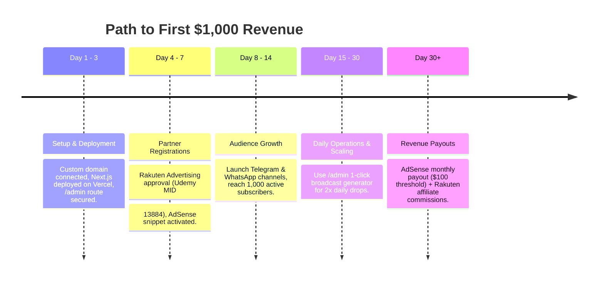

# SOP: Admin Operations & A-Z Revenue Guide

#sop #admin #revenue #monetization #operations #guide #dashboard

> **Document Type:** Master Operational & Revenue SOP  
> **Area:** Platform Administration & Business Operations  
> **Target Audience:** Admin / Platform Owner  
> **Web Admin Route:** [[P01 - Free Course Website MVP|Web Dashboard (/admin)]]  
> **Parent Project:** [[P01 - Free Course Website MVP]]  
> **Monetization Architecture:** [[Architecture - Monetization and Ad Placements]]  
> **Pipeline SOP:** [[SOP - Automated Sourcing Pipeline]]  
> **Broadcast Templates:** [[Swipe File - Broadcast Templates]]  
> **Master Index:** [[Vault Overview]]

---

## 1. Executive Summary & Revenue Model

This platform operates a dual-stream revenue engine powered by high-intent broadcast traffic:

```
Broadcast Channels (Telegram / WhatsApp)
               │
               ▼
   Web Directory Landing Page (AdSense Impressions Served)
               │
               ├─────────────────────────────────┐
               ▼                                 ▼
   [Copy Coupon Code] / [Get Free Course]    Secondary Referral Widgets
               │                             (VPN / Hosting / SaaS)
               ▼                                 │
   Rakuten Deep-Link Redirect                    ▼
               │                           Affiliate Payout
               ▼
   Udemy Checkout ($0.00 to User) ──► 15-45 Day Cookie Commission Payout
```

1. **Display Advertising (Google AdSense):** Every visitor arriving from social broadcasts generates high-viewability ad impressions across header, in-feed, and sticky mobile ad containers.
2. **Affiliate Deep-Linking (Rakuten / Udemy):** Users click "Get Free Course", routing through Rakuten deep-links. When users enroll in free deals or subsequently buy paid courses within the 7-day to 30-day cookie window, affiliate commissions are credited.
3. **Secondary Referral Widgets:** Contextual offers for developer tools (e.g. \$100 VPS credits, 70% OFF VPNs) placed directly on course cards and detail modals.

---

## 2. Using the Dedicated Web Admin Dashboard (`/admin`)

The platform includes a browser-based Admin Console at **`/admin`** for complete hands-free management:

### Accessing the Dashboard
1. Open `https://courses.domain.com/admin` (or `http://localhost:3000/admin` locally).
2. Enter your **Admin Secret Key** (Default key: `admin123` or value set in `.env.local` `ADMIN_SECRET_KEY`).

### Dashboard Features & Capabilities

1. **📊 Real-Time Metric Tickers:**
   - Active Deals Count, Community Flagged Reports, Auto-Suppressed Expired Deals, and Total Catalog Dollar Value.
2. **🛠️ Course Moderation Table:**
   - **Reset Flags:** Clears community reports if a user wrongly flagged a working deal.
   - **Force Expire:** Instantly hides dead deals from the website.
   - **Re-activate:** Restores an expired deal and extends expiry date.
   - **Draft Broadcast Post:** Generates 1-click formatted Telegram/WhatsApp text with UTM tracking parameters ready to drop into social channels.
3. **➕ Add New Course Web Form:**
   - Enter course details (Title, Udemy Link, Coupon Code, Price).
   - Automatically wraps target URL with Rakuten affiliate deep-linking (`MID: 13884`).
4. **⚡️ Live Scraper Sync Button:**
   - 1-Click button to manually trigger the coupon ingestion pipeline.

---

## 3. Pre-Launch Configuration Checklist

Before launching traffic broadcasts, complete this checklist:

### Step 1: Rakuten Advertising Affiliate Registration
1. Register an account on [Rakuten Advertising Publisher Portal](https://rakutenadvertising.com/).
2. Apply to the **Udemy Affiliate Program** (Merchant ID: `13884`).
3. Once approved, copy your unique **Publisher ID (MID)** token from the portal dashboard.
4. Add your Publisher ID to `.env.local` or Vercel Environment Variables:
   ```env
   NEXT_PUBLIC_RAKUTEN_PUB_ID=your_rakuten_publisher_id_here
   ADMIN_SECRET_KEY=your_secure_admin_password_here
   ```

### Step 2: Google AdSense Setup & Approval
1. Deploy the site to your custom domain.
2. Ensure legal pages ([`/privacy-policy`](file:///home/thanushiyan/Desktop/free-course/src/app/privacy-policy/page.tsx), [`/terms-of-service`](file:///home/thanushiyan/Desktop/free-course/src/app/terms-of-service/page.tsx), [`/affiliate-disclosure`](file:///home/thanushiyan/Desktop/free-course/src/app/affiliate-disclosure/page.tsx)) are indexed and accessible.
3. Submit site domain in [Google AdSense Console](https://adsense.google.com/).
4. Add your AdSense Publisher ID to `src/components/AdBanner.tsx`:
   ```tsx
   data-ad-client="ca-pub-XXXXXXXXXXXXXXXX"
   ```

### Step 3: Automated Cron Setup (GitHub Actions)
1. Add `CRON_SECRET` to GitHub Repository Secrets (`Settings > Secrets and variables > Actions`).
2. Verify `.github/workflows/sync-coupons.yml` triggers every 6 hours automatically.

---

## 4. Daily Admin Operational Routine

### Morning Routine (09:00 AM)
1. Open `/admin` dashboard.
2. Click **"Reset Flags"** or **"Force Expire"** on items reported by users.
3. Click **"Sync Scraper Pipeline"** to pull fresh deals.

### Broadcast Drop (12:00 PM & 06:00 PM Peak Traffic Hours)
1. In `/admin` course catalog table, click **"Draft"** next to any top course.
2. Paste pre-formatted post into Telegram Channel and WhatsApp Broadcast Groups.

---

## 5. Revenue Pipeline & Payout Execution


